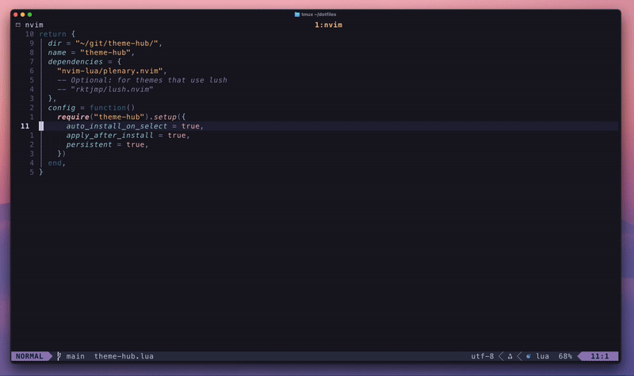

# 🎨 ThemeHub.nvim

A Neovim plugin to quickly try out different themes. Browse, install, and apply colorschemes from a curated list.



## Features

- 🎯 **Curated Collection**: 70+ most popular themes for neovim
- 🚀 **One-Click Installation**: Automatically clone and set up themes from GitHub
- 🔍 **Telescope Pickers Integration**: Works seamlessly with telescope.nvim, fzf-lua, snacks.picker, mini.pick, and more
- 💾 **Persistent Themes**: Remember your theme across Neovim sessions
- 🧩 **Variants support**: Supports all variants of a theme
- 🎨 **Instantly apply**: Applies themes directly after installation
- 🧹 **Easy Management**: Install, uninstall, and manage themes with simple commands

## Installation

### Using [lazy.nvim](https://github.com/folke/lazy.nvim)

```lua
{
    "erl-koenig/theme-hub.nvim",
    dependencies = {
        "nvim-lua/plenary.nvim",
        -- Optional: for themes that use lush (will be notified if a theme requires it)
        -- "rktjmp/lush.nvim"
    },
    config = function()
        require("theme-hub").setup({
            -- Configuration options (see below)
        })
    end,
}
```

## Usage

- `:ThemeHub` - Open the theme selector to browse and install all available themes
- `:ThemeHub install <name>` - Install a specific theme
- `:ThemeHub uninstall <name>` - Uninstall a specific theme
- `:ThemeHub uninstall-all` - Uninstall all themes
- `:ThemeHub clear-persistent` - Clear the saved persistent theme (auto-clears after uninstalling)

After installation it will apply the theme automatically. It will use the first variant of the theme.

## Configuration

**Important:** You must call `setup()` to initialize the plugin.

### Default Configuration

```lua
require("theme-hub").setup({
    install_dir = vim.fn.stdpath("data") .. "/theme-hub",
    auto_install_on_select = true,
    apply_after_install = true,
    persistent = false,
})
```

### Configuration Options

| Option                   | Type    | Default                     | Description                                  |
| ------------------------ | ------- | --------------------------- | -------------------------------------------- |
| `install_dir`            | string  | `stdpath("data")/theme-hub` | Directory where themes are installed         |
| `auto_install_on_select` | boolean | `true`                      | Auto-install themes when selected in browser |
| `apply_after_install`    | boolean | `true`                      | Auto-apply theme after installation          |
| `persistent`             | boolean | `false`                     | Remember last applied theme across restarts  |

### Telescope Integration

This plugin uses `vim.ui.select` to display themes. For the best experience, use it with a telescope-like plugin: telescope.nvim, fzf-lua, snacks.picker, mini.pick, etc. Below is how to set it up with each one:

#### [telescope.nvim](https://github.com/nvim-telescope/telescope.nvim)

```lua
-- Add to your telescope dependencies
dependencies = {
    "nvim-telescope/telescope-ui-select.nvim",
}

-- In your config call
require("telescope").load_extension("ui-select")
```

#### [fzf-lua](https://github.com/ibhagwan/fzf-lua)

Add this to your fzf-lua config:

```lua
require("fzf-lua").register_ui_select({})
```

#### [snacks.picker](https://github.com/folke/snacks.nvim)

Works out of the box. No config needed.

#### [mini.pick](https://github.com/echasnovski/mini.pick)

In your mini config overwrite the default `vim.ui.select` with:

```lua
vim.ui.select = MiniPick.ui_select
```

## Available Themes

See `lua/theme-hub/registry.lua` for the list of curated themes.

## Requirements

- Neovim >= 0.7.0
- Git (for cloning themes)
- [plenary.nvim](https://github.com/nvim-lua/plenary.nvim) (required)
- [lush.nvim](https://github.com/rktjmp/lush.nvim) (optional, for lush-based themes)

## Other

- The plugin doesn't consider themes that are installed via package managers.
- If two themes have the exact same name, the plugin can't distinguish them and will use one of them for both (very rare case)
- Run `:checkhealth theme-hub` to ensure everything works correctly.
- Run `:h theme-hub` to see the help documentation.

## Similar Projects

- [huez.nvim](https://github.com/vague2k/huez.nvim)
- [pineapple](https://github.com/CWood-sdf/pineapple)

## Contribute

Feel free to add new themes to the registry, or open issues for feature requests.
